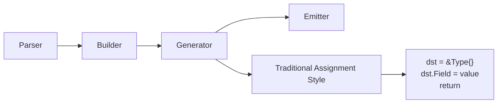
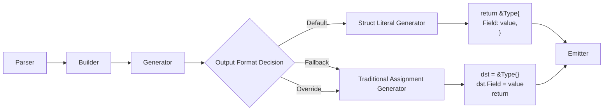
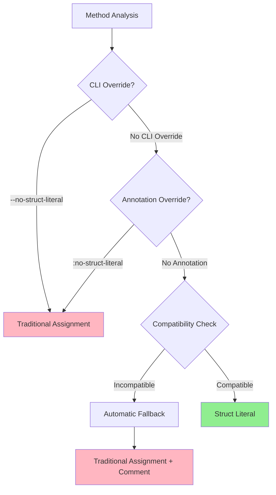

# Struct Literal Output Design

## 1. Architecture Overview

This document provides the technical design for implementing struct literal output as the default behavior in Convergen's code generation pipeline. The design extends the existing 4-stage pipeline (Parser → Builder → Generator → Emitter) with smart output format selection.

## 2. Current System Analysis

### 2.1 Existing Code Generation Flow



### 2.2 Current Implementation Points

**Key Files and Extension Points:**
- `pkg/generator/function.go:FuncToString()` - Main function generation logic (lines 91-102)
- `pkg/generator/assignment.go` - Assignment statement generation
- `pkg/generator/model/enums.go` - `DstVarStyle` enum definitions
- `pkg/option/option.go` - Annotation parsing and processing
- `cmd/convergen/main.go` - CLI flag processing

**Current DstVarStyle Values:**
```go
type DstVarStyle int
const (
    DstVarReturn DstVarStyle = iota  // func() (dst Type)
    DstVarArg                        // func(dst *Type)
)
```

## 3. Proposed Architecture

### 3.1 Enhanced Code Generation Flow



### 3.2 Decision Engine Architecture



## 4. Technical Design Details

### 4.1 Domain Model Extensions

**Extend DstVarStyle Enum:**
```go
// pkg/generator/model/enums.go
type DstVarStyle int

const (
    DstVarReturn        DstVarStyle = iota  // Existing: func() (dst Type)
    DstVarArg                               // Existing: func(dst *Type)  
    DstVarStructLiteral                     // NEW: func() Type { return &Type{} }
)

// Add helper method
func (d DstVarStyle) IsStructLiteral() bool {
    return d == DstVarStructLiteral
}
```

**Extend Function Model:**
```go
// pkg/generator/model/function.go
type Function struct {
    // ... existing fields
    OutputStyle      OutputStyle   // NEW: Controls generation style
    FallbackReason   string       // NEW: Documents why fallback was used
    CanUseStructLit  bool         // NEW: Compatibility flag
}

type OutputStyle int
const (
    OutputStyleAuto           OutputStyle = iota  // Default: use struct literal if possible
    OutputStyleStructLiteral                      // Force struct literal
    OutputStyleTraditional                        // Force traditional assignment
)
```

### 4.2 Option System Extensions

**Extend Option Structure:**
```go
// pkg/option/option.go
type Options struct {
    // ... existing fields
    NoStructLiteral   bool    // NEW: Disable struct literal output
    ForceStructLit    bool    // NEW: Force struct literal (ignore compatibility)
    StructLitStyle    string  // NEW: Future: formatting options
}

// Add parsing for new annotations
func (o *Options) parseNoStructLiteral(line string) {
    if strings.Contains(line, ":no-struct-literal") {
        o.NoStructLiteral = true
    }
}
```

**CLI Integration:**
```go
// cmd/convergen/main.go
var (
    noStructLiteral = flag.Bool("no-struct-literal", false, 
        "Disable struct literal output, use traditional assignment")
    structLiteral = flag.Bool("struct-literal", true,
        "Enable struct literal output (default)")
    verbose = flag.Bool("verbose", false,
        "Show generation decisions and fallback reasons")
)
```

### 4.3 Core Generation Logic

**Enhanced Function Generation:**
```go
// pkg/generator/function.go
func (g *Generator) FuncToString(f *model.Function) string {
    // Determine output style based on priority
    outputStyle := g.determineOutputStyle(f)
    
    switch outputStyle {
    case OutputStyleStructLiteral:
        return g.generateStructLiteralFunction(f)
    case OutputStyleTraditional:
        return g.generateTraditionalFunction(f)
    default:
        // Auto mode - check compatibility
        if g.canUseStructLiteral(f) {
            return g.generateStructLiteralFunction(f)
        } else {
            f.FallbackReason = g.getFallbackReason(f)
            return g.generateTraditionalFunction(f)
        }
    }
}
```

**Output Style Decision Logic:**
```go
func (g *Generator) determineOutputStyle(f *model.Function) OutputStyle {
    // Priority 1: CLI flags (highest)
    if g.Options.NoStructLiteral {
        return OutputStyleTraditional
    }
    
    // Priority 2: Method-level annotations
    if f.Options.NoStructLiteral {
        return OutputStyleTraditional  
    }
    
    // Priority 3: Interface-level annotations
    if f.InterfaceOptions.NoStructLiteral {
        return OutputStyleTraditional
    }
    
    // Priority 4: Default behavior
    return OutputStyleAuto
}
```

### 4.4 Struct Literal Generator Implementation

**Core Struct Literal Generation:**
```go
func (g *Generator) generateStructLiteralFunction(f *model.Function) string {
    var sb strings.Builder
    
    // Generate function signature (reuse existing logic)
    g.writeFunctionSignature(&sb, f)
    
    // Handle preprocess (if any - should be rare due to compatibility check)
    if f.PreProcess != nil {
        g.writePreProcess(&sb, f)
        // Fall back to traditional assignment after preprocess
        return g.generateHybridFunction(f)
    }
    
    // Generate struct literal return
    sb.WriteString(fmt.Sprintf("return %s{\n", g.getStructLiteralType(f)))
    
    // Generate field assignments within struct literal
    for _, assignment := range f.Assignments {
        if g.canAssignInStructLiteral(assignment) {
            sb.WriteString(g.formatStructLiteralField(assignment))
        } else {
            // This should not happen due to compatibility pre-check
            // But gracefully fall back if it does
            return g.generateHybridFunction(f)
        }
    }
    
    sb.WriteString("}\n}\n")
    
    // Handle postprocess (requires hybrid approach)
    if f.PostProcess != nil {
        return g.generateHybridFunction(f)
    }
    
    return sb.String()
}
```

**Struct Literal Field Formatting:**
```go
func (g *Generator) formatStructLiteralField(assignment model.Assignment) string {
    fieldName := assignment.DstField()
    value := assignment.Value()
    
    // Handle error-returning assignments (shouldn't happen in struct literal)
    if assignment.RetError() {
        // This indicates a compatibility check failure
        panic("Error-returning assignment in struct literal context")
    }
    
    return fmt.Sprintf("    %s: %s,\n", fieldName, value)
}
```

### 4.5 Compatibility Detection

**Compatibility Analysis:**
```go
func (g *Generator) canUseStructLiteral(f *model.Function) bool {
    // Check for incompatible features
    if f.PreProcess != nil || f.PostProcess != nil {
        return false
    }
    
    // Check for incompatible style
    if f.DstVarStyle == model.DstVarArg {
        return false
    }
    
    // Check assignments compatibility
    for _, assignment := range f.Assignments {
        if !g.canAssignInStructLiteral(assignment) {
            return false
        }
    }
    
    return true
}

func (g *Generator) canAssignInStructLiteral(assignment model.Assignment) bool {
    // Error-returning assignments need imperative style
    if assignment.RetError() {
        return false
    }
    
    // Complex assignments (multiple statements) need imperative style
    if assignment.IsComplex() {
        return false
    }
    
    // Simple value assignments are compatible
    return true
}
```

**Fallback Reason Documentation:**
```go
func (g *Generator) getFallbackReason(f *model.Function) string {
    if f.PreProcess != nil {
        return "preprocess annotation requires imperative execution"
    }
    if f.PostProcess != nil {
        return "postprocess annotation requires imperative execution"
    }
    if f.DstVarStyle == model.DstVarArg {
        return ":style arg annotation incompatible with struct literal"
    }
    
    for _, assignment := range f.Assignments {
        if assignment.RetError() {
            return "error-returning conversion functions require error checking"
        }
    }
    
    return "complex assignments require imperative style"
}
```

### 4.6 Hybrid Generation for Edge Cases

**Mixed Style Generation:**
```go
func (g *Generator) generateHybridFunction(f *model.Function) string {
    // For cases where partial struct literal is possible
    // but some elements need imperative handling
    
    var sb strings.Builder
    g.writeFunctionSignature(&sb, f)
    
    // Preprocess
    if f.PreProcess != nil {
        g.writePreProcess(&sb, f)
    }
    
    // Try struct literal for simple fields
    simpleAssignments, complexAssignments := g.partitionAssignments(f.Assignments)
    
    if len(simpleAssignments) > len(complexAssignments) {
        // Majority are simple - use struct literal base with additions
        sb.WriteString(fmt.Sprintf("result := %s{\n", g.getStructLiteralType(f)))
        for _, assignment := range simpleAssignments {
            sb.WriteString(g.formatStructLiteralField(assignment))
        }
        sb.WriteString("}\n\n")
        
        // Handle complex assignments imperatively
        for _, assignment := range complexAssignments {
            sb.WriteString(g.formatTraditionalAssignment(assignment, "result"))
        }
        
        sb.WriteString("return result\n")
    } else {
        // Majority are complex - use traditional style
        return g.generateTraditionalFunction(f)
    }
    
    // Postprocess
    if f.PostProcess != nil {
        g.writePostProcess(&sb, f)
    }
    
    return sb.String()
}
```

## 5. Integration Points

### 5.1 Parser Integration

**No changes required** - Parser continues to extract annotations and build domain models. New annotations (`:no-struct-literal`) are processed by existing annotation parsing infrastructure.

### 5.2 Builder Integration

**Minimal changes** - Builder may need to set compatibility flags during model construction, but core field mapping logic remains unchanged.

### 5.3 Generator Integration

**Primary changes** - Generator gains new struct literal generation capability and decision engine. Existing traditional assignment generation is preserved for compatibility.

### 5.4 Emitter Integration

**No changes required** - Emitter continues to receive generated code strings and emit them to files. The format of the strings changes, but the interface remains the same.

## 6. Error Handling Strategy

### 6.1 Compatibility Errors

**Pre-Generation Validation:**
```go
func (g *Generator) validateStructLiteralCompatibility(f *model.Function) error {
    if f.Options.ForceStructLit && !g.canUseStructLiteral(f) {
        return fmt.Errorf("method %s forced to use struct literal but has incompatible features: %s",
            f.Name, g.getFallbackReason(f))
    }
    return nil
}
```

### 6.2 Generation Errors

**Graceful Degradation:**
- If struct literal generation fails unexpectedly, fall back to traditional assignment
- Log warning about fallback with reason
- Continue generation to avoid blocking entire pipeline

### 6.3 Verbose Mode Reporting

```go
func (g *Generator) reportGenerationDecision(f *model.Function, decision OutputStyle) {
    if g.Options.Verbose {
        switch decision {
        case OutputStyleStructLiteral:
            fmt.Printf("INFO: Method %s using struct literal output\n", f.Name)
        case OutputStyleTraditional:
            fmt.Printf("INFO: Method %s using traditional assignment (%s)\n", 
                f.Name, f.FallbackReason)
        }
    }
}
```

## 7. Performance Considerations

### 7.1 Generation Performance

**Expected Impact:**
- Compatibility checking adds minimal overhead (O(n) where n = number of assignments)
- Struct literal generation is simpler than traditional assignment generation
- Overall generation time should remain similar or improve slightly

### 7.2 Generated Code Performance

**Expected Benefits:**
- Struct literals may allow better compiler optimizations
- Fewer intermediate assignments may reduce allocations
- More idiomatic Go code may benefit from runtime optimizations

## 8. Migration Strategy

### 8.1 Backward Compatibility Guarantee

**Generated Code Compatibility:**
- With `--no-struct-literal` flag, generated code is identical to v8.0.x
- All existing annotations continue to work without changes
- Function signatures remain unchanged

### 8.2 Migration Tooling

**Analysis Tool:**
```bash
convergen --analyze-migration input.go
# Output:
# ✅ 15 methods compatible with struct literal
# ⚠️  3 methods will use fallback (preprocess/postprocess)
# 📝 Use --no-struct-literal for identical output to v8.0.x
```

## 9. Testing Strategy

### 9.1 Unit Testing

**Generator Tests:**
- Test struct literal generation for simple cases
- Test fallback detection and traditional generation
- Test priority system for override decisions
- Test error handling and graceful degradation

### 9.2 Integration Testing

**End-to-End Tests:**
- Generate code for complex interfaces with mixed compatibility
- Verify generated code compiles and executes correctly
- Test CLI flag integration and override behavior
- Test annotation processing and priority resolution

### 9.3 Compatibility Testing

**Regression Testing:**
- Verify existing test suites pass with new default behavior
- Compare generated code with and without `--no-struct-literal`
- Test migration analysis tool accuracy

Addresses requirements from requirements.md, implementation steps in tasks.md.